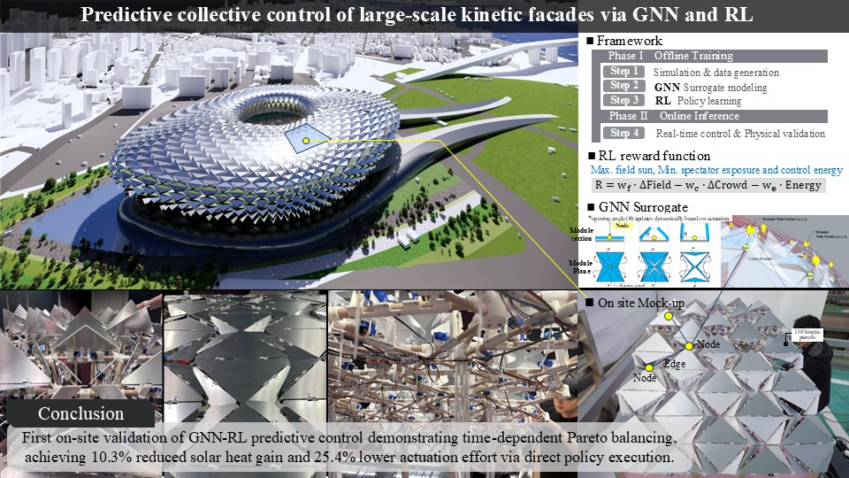

# GNN-RL-Kinetic-Facade

**Real-time collective control of a large-scale kinetic facade via a GNN surrogate model and PPO reinforcement learning.**
<p align="center">
  
</p>

<p align="center">
  
  
</p>

This repository contains the reference implementation used in our JCDE manuscript:

> **Predictive collective control of large-scale kinetic facades via Graph Neural Networks and Reinforcement Learning: From simulation to physical validation**

---

## 1) What this repo provides

- **GNN surrogate** (GraphRegressorV2 / GIN-style message passing) for fast solar-irradiance proxy prediction on a 3D curved facade graph.
- **PPO-based controller** that outputs sector-level actions, then converts them to module-level actuation via **sector-to-module mapping (B)** and **neighbor smoothing (M)**.
- A **reproducible pipeline** that supports:
  - training the surrogate,
  - training the RL agent inside the surrogate environment,
  - replaying learned actions in a high-fidelity physics engine (Ladybug) for bias checking,
  - running the learned policy on a physical mock-up (global inference, local actuation).

---

## 2) Runtime / environment

Tested configuration (as used in our experiments):

- **Python**: 3.10
- **PyTorch**: 2.6.0
- **Config**: **OmegaConf** (YAML-based config loading)
- **GPU**: CUDA-capable GPU recommended (training is significantly faster)

> Note: Minor version differences may work, but the above versions are the ones verified during our final experimental runs.

---

## 3) Installation

```bash
git clone https://github.com/younghochai/GNN-RL-Kinetic-Facade.git
cd GNN-RL-Kinetic-Facade

# (Recommended) create a clean environment
conda create -n gnnrl python=3.10 -y
conda activate gnnrl

pip install -r requirements.txt
```

---

## 4) Data and reproducibility policy (important)

The original experiments were trained/evaluated using a large simulation dataset (9,229 samples) and additional intermediate artifacts (physics-engine replays, logs, plots, checkpoints).  
To keep public downloads lightweight, we provide **sample-only** data packages and share full data **upon request**:

### Tier A — GitHub (minimal package)
This GitHub repository is intentionally lightweight and includes:

- Core source code (`src/`) and configs
- A **very small** sample dataset in `data/` (**only for smoke testing**: data loading → surrogate inference → RL training loop)

⚠️ **With the GitHub-only sample data, you should not expect to reproduce the exact paper-level quantitative results.**  
It is designed to verify that the pipeline runs end-to-end.

### Tier B — Google Drive (extended package, still sample-only)
Because some folders (notebooks with outputs, example results, checkpoints) are too large for a standard GitHub repo, we provide an **extended reproduction package** via Google Drive:

```text
Google Drive folder (extended package):
https://drive.google.com/drive/folders/13C7dEEJiAXQ7u79G5_yknCu903BH6tE1?usp=sharing
```

Important notes:

- The Google Drive package also contains **sample-only** data (it does **not** include the full 9,229 samples).
- It is intended to help others **run representative training/evaluation** and inspect example outputs more easily than the GitHub-minimal package.

### Tier C — Full dataset (9,229 samples) and full simulation files
The complete simulation dataset (9,229 samples) and full simulation-generation files are **available upon reasonable request** for research reproducibility purposes.  
Please contact the corresponding author (see **Contact**) with a brief description of your intended use.

---

## 5) Quickstart

### 5.1 Train the GNN surrogate

We provide a notebook workflow for surrogate training:

```bash
jupyter lab notebooks/Main_GNN_RL_Training.ipynb
```

The notebook covers dataset loading, model training, evaluation, and saving trained checkpoints.

### 5.2 Train the RL controller (PPO)

Train the PPO agent with the default configuration:

```bash
python src/rl/train.py   --config src/rl/configs/default_low.yaml   --device cuda   --run_name experiment_001
```

- `--device cpu` is supported but will be much slower.
- Outputs (checkpoints/logs) are saved under the run directory configured in the YAML.

---

## 6) Reproducing the paper’s evaluation layers

The codebase is organized around the paper’s validation structure:

- **Layer-1**: surrogate accuracy (train/test metrics; architecture & topology ablations)
- **Layer-2**: closed-loop RL control inside the surrogate environment
- **Layer-3**: high-fidelity replay in the physics engine (Ladybug recomputation)
- **Layer-4**: physical mock-up execution (global inference, local actuation)

See the manuscript and supplement for the exact metric definitions (ROI, sampling points, aggregation operator, time window, units).

---

## 7) What to upload to GitHub vs. what to keep off GitHub

### Recommended to keep in GitHub
- `src/` (all core code)
- `notebooks/` (key notebooks; **please clear notebook outputs** before committing)
- `configs/` or `src/**/configs/` (YAML configs required to run training)
- `requirements.txt` (and/or `environment.yml`)
- `README.md`, `LICENSE`
- `data/` (**minimal sample only**; just enough to run a short smoke test)
- `tests/` (optional, if lightweight)

### Recommended to keep out of GitHub (share via Drive or request)
- Large raw datasets / full simulation samples (9,229)
- Large intermediate outputs: `outputs/`, `results/`, `baseline_results/`, `temp/`, etc.
- Large checkpoints and logs (unless using Git LFS)

---

## 8) Data & code availability (for the paper)

- **Code**: available in this GitHub repository.
- **Sample data**:
  - minimal sample (GitHub),
  - extended sample package (Google Drive link above).
- **Full data (9,229 samples)**: available upon request.

---

## 9) Citation

If you use this repository, please cite our JCDE paper:

```text
[Add final citation after publication]
```

---

## 10) License

MIT License

Copyright (c) 2026 Youngho Chai and Soochul Shin

Permission is hereby granted, free of charge, to any person obtaining a copy
of this software and associated documentation files (the "Software"), to deal
in the Software without restriction, including without limitation the rights
to use, copy, modify, merge, publish, distribute, sublicense, and/or sell
copies of the Software, and to permit persons to whom the Software is
furnished to do so, subject to the following conditions:

The above copyright notice and this permission notice shall be included in all
copies or substantial portions of the Software.

THE SOFTWARE IS PROVIDED "AS IS", WITHOUT WARRANTY OF ANY KIND, EXPRESS OR
IMPLIED, INCLUDING BUT NOT LIMITED TO THE WARRANTIES OF MERCHANTABILITY,
FITNESS FOR A PARTICULAR PURPOSE AND NONINFRINGEMENT. IN NO EVENT SHALL THE
AUTHORS OR COPYRIGHT HOLDERS BE LIABLE FOR ANY CLAIM, DAMAGES OR OTHER
LIABILITY, WHETHER IN AN ACTION OF CONTRACT, TORT OR OTHERWISE, ARISING FROM,
OUT OF OR IN CONNECTION WITH THE SOFTWARE OR THE USE OR OTHER DEALINGS IN THE
SOFTWARE.

---

## Contact

- **Youngho Chai** (Corresponding author)
- GitHub Issues are welcome for bug reports and reproducibility questions.
- For full-dataset requests (9,229 samples), please contact the author via the email address provided in the paper.
